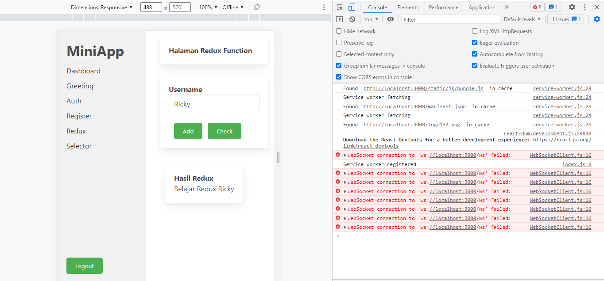

# MINIAPP - PWA
### Install Package
#### Instalasi semua package yang diperlukan dalam menjalankan miniapp
```bash
npm install
```


### Run
#### Ada dua command yang harus di run  yaitu:
```bash
npm start
```

---------
#### Screenshoot 1
PWA Console Log  (force offline network)


#### Screenshoot 2
PWA Performance Lighthouse


#### Screenshoot 3
PWA Service Worker Register


#### Screenshoot 4
PWA Installing App

